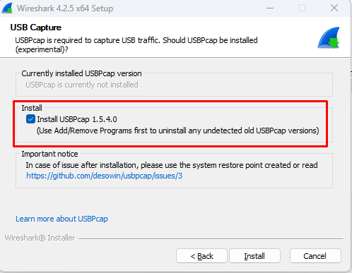
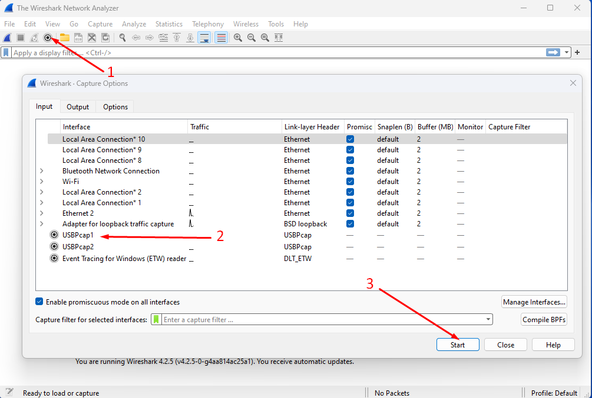
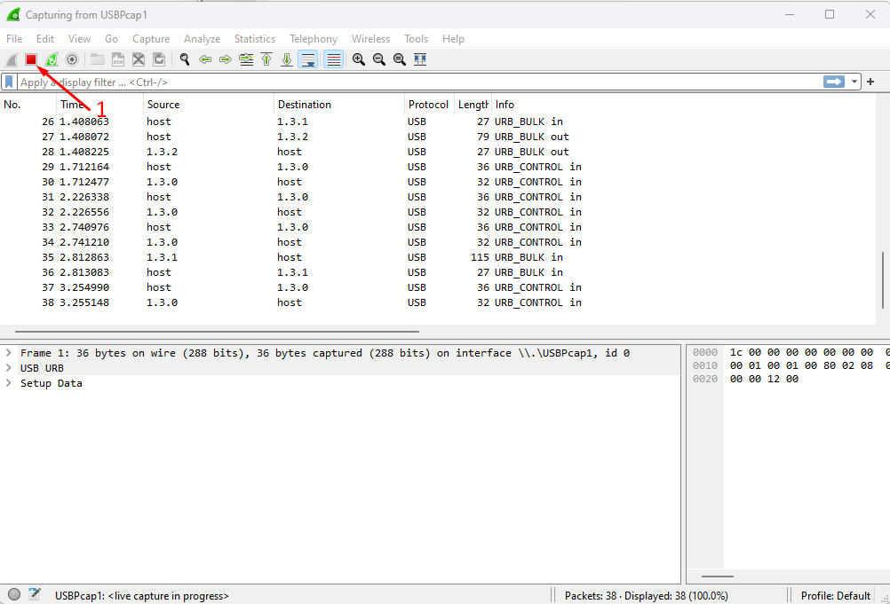

# Wireshark capture

## Introduction
This document shows how to perform a Wireshark capture to debug deep problems.

## Download wireshark
https://www.wireshark.org/download.html - Usually you have to install "Windows x64 Installer"

## Install wireshark

This step is important, you have to install Wireshark **with** "USBPcap".

Start the Wireshark installation (Next, Next ...)

When you reach this screen:

You have to check Install USBPcap, then continue the installation

## Capture
This chapter describes how to capture USB traffic with Wireshark.

### How to start a capture

### How to stop a capture

### How to find the correct USBPcap
(Skip this step if you have only 1 USBPcap - USBPcap1)

You will probably see multiple USBPcaps when you try to start a capture, you may have USBPcap1, USBPcap2, USBPcap3, USBPcap4 ... This corresponds to the USB host controller present on your system, so it depends on your system. We need to find the correct USB host controller (where is your controller plugged in)

1. Start a capture on a USBPcap (USBPcap1, USBPcap2, ...)
2. Wait without using any USB device (mouse, keyboard, ...) - Here you will have 2 behaviours, either nothing will move or you will have a constant flow of data.
3. Now connect your controller:
  - If you see new data coming or if you see data going faster, you probably found the correct USBPcap. 
  - If you see no changes, you have selected the wrong USBPcap. Repeat these steps with the next USBPcap.

### Procedure to have a clean capture
Once you have found the correct USBPcap (see the steps above), we can start a clean capture.
To capture the boot sequence with Wireshark, you need to unplug your USB controller first.
During the Wireshark capture, try not to use your other USB devices (mouse, keyboard, audio etc...) - it will make the investigation easier for the maintainer.

Steps:
 - Start the capture on the correct USBPcap
 - Connect the USB controller
 - Wait 1s or 2s
 - Then press/release one button several times (This will help the maintainer to find your controller)
 - Stop the capture
 - Save it (File -> Save As)
